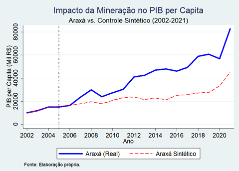
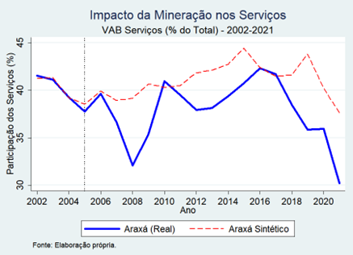

# Impacto Socioeconômico da Mineração de Nióbio em Araxá (MG): Uma Abordagem de Controle Sintético

Este repositório contém o código e os resultados do meu Trabalho de Conclusão de Curso (TCC) em **Ciências Econômicas pela Universidade Federal de Uberlândia (UFU)**. O objetivo da pesquisa é avaliar os impactos da exploração de nióbio em Araxá sobre variáveis de PIB, emprego e indicadores sociais.

---

## 🛠️ Tecnologias e Metodologia

A análise seguiu um pipeline rigoroso de Ciência de Dados Aplicada à Economia:

1. **Tratamento de Dados (Python/Pandas):** Limpeza, padronização e consolidação de bases de dados do IBGE, RAIS e fontes públicas.
2. **Modelagem Econométrica (Stata):** Aplicação do **Método de Controle Sintético (SCM)** para isolar o efeito causal da atividade mineradora.
3. **Validação e Robustez:** Realização de testes de **Placebo no Espaço** e análise da **Razão RMSPE**.

---

## 📂 Estrutura do Repositório

* **`01-tratamento-python/`**: Notebooks Jupyter com o *Data Wrangling* e criação da base consolidada.
* **`02-modelagem-stata/`**: Arquivo `.do` com os comandos de regressão e testes de robustez.
* **`03-resultados-graficos/`**: Visualizações dos resultados e tabelas de validação.

---

## 📈 Conclusões em Destaque

A análise revela um contraste importante no impacto econômico da mineração em Araxá:

* **Crescimento do PIB:** Observa-se um descolamento positivo significativo de Araxá em relação ao seu controle sintético, confirmando o forte impacto da atividade mineradora na riqueza agregada.
* **Setor de Serviços (VAB):** Curiosamente, o Valor Adicionado Bruto de serviços mostrou-se inferior ao contrafactual sintético, sugerindo que a riqueza da mineração pode não estar gerando um efeito de encadeamento proporcional no setor terciário local.
* **Indicadores Sociais e Saúde:** As variáveis de saúde (como mortalidade infantil e internações) não apresentaram melhoria relativa em comparação ao controle sintético, indicando que o aumento do PIB não foi acompanhado por uma evolução equivalente no bem-estar social imediato.

### Visualização dos Contrastes:

| PIB per capita (Crescimento) | VAB Serviços (Estagnação) |
|:---:|:---:|
|  |  |

---

## 📄 Trabalho Completo
Para uma análise detalhada da fundamentação teórica, revisão de literatura e discussão dos resultados, o TCC completo está disponível no link abaixo:

* [Download do TCC em PDF](seu-arquivo-tcc.pdf)

---

## 💡 Sobre mim
Sou estudante de Economia na **UFU**, com experiência em consultoria financeira para PMEs e focado em transformar dados brutos em insights estratégicos.

---

### Como usar este repositório
1. Os scripts de tratamento estão em Python (Anaconda/Jupyter).
2. A modelagem requer o Stata com os pacotes `synth` e `polspline` instalados.
